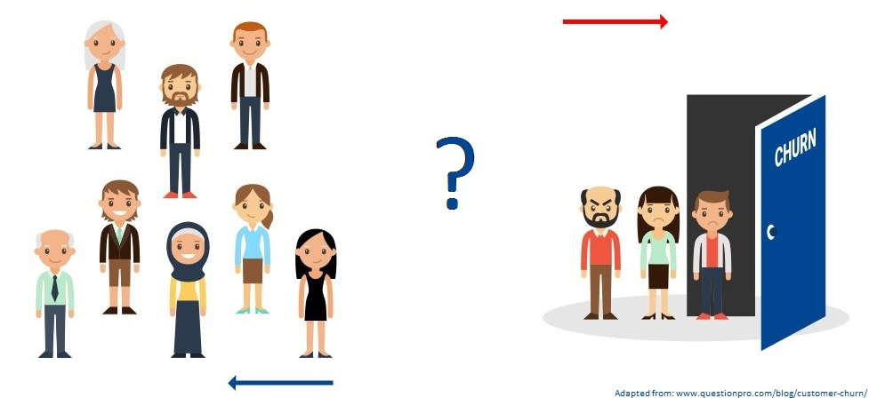

# Customer Churn Prediction
This is a machine learning project for customer churn prediction.
The project was developed during the Machine Learning discipline (EEC1509) of the Postgraduate Program in Electrical and Computer Engineering at the Technology Center of the Federal University of Rio Grande do Norte, in May 2022.

### Team
 - Supervisor: Prof. Ivanovitch (www.linkedin.com/in/ivanovitchm)

 - Developers: J. Marcos Leal (www.linkedin.com/in/macleal), Lucas Ismael (www.linkedin.com/in/lucasismaelcm).

Last Update: May 30, 2022.

## Project Purpose:
Perform the prediction of customer dropout of a given service.

## Project Description
This project develops a complete data pipeline with a Decision Tree Classification Model, using Google Colab, Scikit-Learn and Weights & Bias. The Jupter Notebook script is here [source/ml_project/churn_prediction.ipynb](https://github.com/jmacleal/customer_churn_prediction/blob/main/source/ml_project/churn_prediction.ipynb).
The data pipeline is composed of the following stages: 1) ``Extract, Transform and Load (ETL)``, 2) ``Data Check``, 3) ``Data Segregation``, 4) ``Trainning and Validation``, 5) ``Test``.
It is put in production and deployed using FastAPI, GitHub, PyTest and Heroku. See the aplication [here](https://customer--churn--prediction.herokuapp.com/docs).
A big picture of the project is presented below.

## References
[1] MITCHELL, Margaret et al. Model Cards for Model Reporting, 2019. Accessed May 30, 2022. Avaliable [here](https://arxiv.org/abs/1810.03993).

[2] https://www.thepythoncode.com/article/customer-churn-detection-using-sklearn-in-python

[3] https://colab.research.google.com/drive/1az3zBurhlcZfLJ2j2kZNlBtflsOQ5CUg?usp=sharing

[4] https://github.com/ivanovitchm/ppgeecmachinelearning.

[5] https://github.com/ivanovitchm/colab2mlops.

