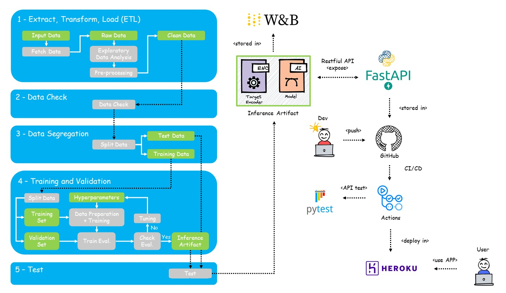

# Model Card

Last updated: May 2022

Inspired by [Model Cards for Model Reporting (Mitchell et al.)](https://arxiv.org/abs/1810.03993).

## Model Details

* Developed by students during the Machine Learning discipline (EEC1509) of the Postgraduate Program in Electrical and Computer Engineering at the Technology Center of the Federal University of Rio Grande do Norte, in May 2022.
* A complete data pipeline was built using Google Colab, Scikit-Learn and Weights & Bias to train a Decision Tree Classification Model. Access to the file [here](https://github.com/jmacleal/customer_churn_prediction/blob/main/source/ml_project/churn_prediction.ipynb). 
* The data pipeline is composed of the following stages: 1) ``Extract, Transform and Load (ETL)``, 2) ``Data Check``, 3) ``Data Segregation``, 4) ``Trainning and Validation``, 5) ``Test``.
* FastAPI, GitHub, PyTest and Heroku are used for deploy the pipeline in production. See the aplication [here](https://customer--churn--prediction.herokuapp.com/docs).

A big picture of the project is presented below.

## Intended Use
* Intended to be used for predicting customer churn 
* The model trained in this project was used to validate a complete data pipeline and to put it into production.
* It can be used for academic concept proofing for the evaluation of an entire data pipeline incorporating MLOps assumptions. 

## Training Data
The dataset contains 10.000 rows (each representing an unique customer) with 14 columns: 13 general features and one target feature (**Exited**). The data is composed of both numerical and categorical features:
**Numeric Features:** ``RowNumber, CustomerId, CreditScore, Age, Tenure, Balance, NumOfProducts, EstimatedSalary``.
**Categorical Features:** ``Surname, Geography, Gender, HasCrCard, IsActiveMember``.
**The target column:** ``Exited``.

The dataset can be seen and downloaded [here](https://www.kaggle.com/datasets/aakash50897/churn-modellingcsv?resource=download).

## Evaluation Data
The dataset under study is split into Train and Test during the ``Segregate`` stage of the data pipeline. 70% of the clean data is used to Train and the remaining 30% to Test. Additionally, 30% of the Train data is used for validation purposes (hyperparameter-tuning).

## Metrics
The metrics adopted for the machine learning experiment performance are: [accuracy](https://scikit-learn.org/stable/modules/generated/sklearn.metrics.accuracy_score.html), [f1](https://scikit-learn.org/stable/modules/generated/sklearn.metrics.f1_score.html#sklearn.metrics.f1_score), [precision](https://scikit-learn.org/stable/modules/generated/sklearn.metrics.precision_score.html#sklearn.metrics.precision_score), [recall](https://scikit-learn.org/stable/modules/generated/sklearn.metrics.recall_score.html#sklearn.metrics.recall_score).

Metrics are calculated in "Export the best model" and "Testing" sections of the churn_prediction.ipynb script available [here](https://github.com/jmacleal/customer_churn_prediction/blob/main/source/ml_project/churn_prediction.ipynb).

The results are shown below:

 **Stage [Run]**                        | **Accuracy** | **F1**  | **Precision** | **Recall** | 
---------------------------------|--------------|---------|---------------|------------|
Train [wandering-sweep-10](https://wandb.ai/eec1509/churn_prediction_project/runs/oonh4fwy/overview?workspace=user-macleal) | 0.80048      | 0.52332 | 0.50998       | 0.53738    |  
Test [decent-sweep-12](https://wandb.ai/eec1509/churn_prediction_project/runs/193ucjlu/overview?workspace=user-macleal)  | 0.79467      | 0.51496 | 0.49621       | 0.53519    |

## Ethical Considerations
One might think that this dataset can be used to predict customer churn of a particular service anywhere. However, these data represent the reality of people from specific countries (France, Spain and Germany), with specific characteristics. For other regions a new dataset may be required.

## Caveats and Recommendations
It should be noted that the model trained in this project was used only to validate a complete data pipeline and to put it into production. It may not meet a specific demand.